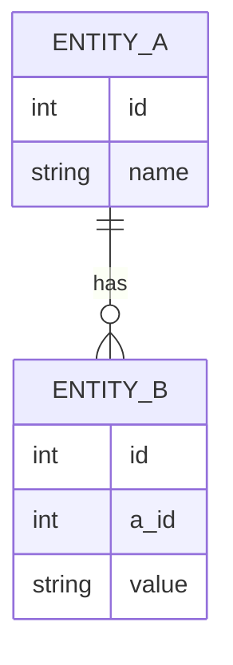

# Шаблоны и стандарты артефактов

> Справочный документ для AI-Augmented Team Transformation Guide. Содержит шаблоны, стандарты и примеры оформления артефактов.

---

## 1. Принципы AI-friendly + human-readable формата

Все артефакты проекта оформляются по шести принципам, обеспечивающим одновременную удобочитаемость для людей и машин:

1. **Структурированный markdown** — каждый артефакт имеет предсказуемую структуру заголовков и секций. ИИ-агент может парсить документ по секциям, а человек — читать целиком.
2. **Обязательные заголовки** — каждая секция начинается с `##`. Агенты и люди мгновенно находят нужный блок.
3. **Связи через идентификаторы** — артефакты ссылаются друг на друга через уникальные ID: `US-42`, `TS-15`, `FR-3`, `ADR-7`. Это позволяет автоматически отслеживать зависимости и покрытие.
4. **Чеклисты (checkboxes)** — критерии приёмки, готовность к релизу, ревью — всё через `- [ ]` / `- [x]`. Машиночитаемо и визуально понятно.
5. **Минимум свободного текста в критичных полях** — где важна точность (API, требования, метрики), используем таблицы, списки, YAML. Свободный текст — только для контекста и рассуждений.
6. **YAML frontmatter для метаданных** — статус, автор, дата, версия, связи. Строго типизированные поля в начале файла между `---`.

---

## 2. Стандарты для типов артефактов

| Тип артефакта | Рекомендуемый стандарт | Описание |
|---|---|---|
| API Specification | OpenAPI 3.x (Swagger) | Формальное описание REST API: эндпоинты, схемы, ошибки. Генерация кода и документации. |
| Technical Specification | OpenSpec (Spec-Driven Development) | Спецификация задач на основе openspec.dev — структурированное описание требований для ИИ-агентов. |
| Architecture Document | C4 Model + ADR | C4 для визуализации (Context → Container → Component → Code), ADR (Architecture Decision Records) для ключевых решений. |
| User Stories | INVEST + BDD (Given/When/Then) | INVEST-критерии для качества историй, BDD-формат для приёмочных критериев. |
| UI Specification | Design Tokens (W3C) + Figma API | Дизайн-токены как единственный источник истины для цветов, типографики, отступов. Figma — для макетов. |
| Test Cases | Gherkin (BDD) | `Given` / `When` / `Then` сценарии. Единый формат для ручных и автоматизированных тестов. |
| Code Conventions | EditorConfig + ESLint / Prettier configs | Автоматическое форматирование. Конфиги в репозитории — единый стандарт для всех (включая ИИ). |
| PR Description | Conventional Commits | `feat:`, `fix:`, `refactor:` и т.д. Структурированные описания изменений, автоматический changelog. |

---

## 3. Принцип: стандарт → шаблон → автоматизация

Переход от хаоса к системе за четыре шага:

1. **Выбрать стандарт** — определить, какой формат лучше всего подходит для типа артефакта (из таблицы выше).
2. **Создать шаблон** — зафиксировать структуру в markdown-файле с плейсхолдерами `{like this}`.
3. **Валидировать на практике** — использовать шаблон в 2-3 реальных задачах, уточнить структуру по обратной связи.
4. **Автоматизировать** — ИИ-агент заполняет шаблон по контексту, CI проверяет обязательные поля, генерируется boilerplate.

```
Стандарт → Шаблон → Валидация → Автоматизация
```

---

## 4. Требования к шаблонам

Каждый шаблон должен удовлетворять:

1. **YAML frontmatter** — минимум: `status`, `author`, `date`. Дополнительные поля по типу артефакта.
2. **Уникальный идентификатор** — `US-{n}`, `TS-{n}`, `ADR-{n}` и т.д. для трассировки.
3. **Связи с другими артефактами** — секция `## Related` или поле `related` во frontmatter.
4. **Все критичные поля — структурированы** — таблицы, списки, чеклисты. Не «напишите текст», а «заполните поля».

---

## 5. Минимальный набор шаблонов

Директория `templates/` проекта:

```
templates/
├── product-research.md
├── prd.md
├── user-story.md
├── task-specification.md
├── api-specification.md
├── ui-specification.md
├── design-token.md
├── architecture-document.md
├── module-boundaries.md
├── architecture-review.md
├── test-plan.md
├── test-case.md
├── bug-report.md
├── pr-description.md
├── release-notes.md
└── code-review.md
```

16 файлов — полный набор для покрытия жизненного цикла продукта от исследования до релиза.

---

## 6. Примеры шаблонов

### Product Research Report

```markdown
---
status: draft
author: {PO name}
date: {YYYY-MM-DD}
---

# Product Research Report

## Market Overview

{Описание рынка, размер, динамика}

## Competitors

### {Competitor 1}

- **Сильные стороны:** {list}
- **Слабые стороны:** {list}
- **Ключевые фичи:** {list}
- **Целевая аудитория:** {описание}
- **Ценовая модель:** {описание}

### {Competitor 2}

- **Сильные стороны:** {list}
- **Слабые стороны:** {list}
- **Ключевые фичи:** {list}
- **Целевая аудитория:** {описание}
- **Ценовая модель:** {описание}

## Market Gaps

- {Незаполненная ниша / проблема / потребность 1}
- {Незаполненная ниша / проблема / потребность 2}

## Hypotheses

- [ ] {Гипотеза 1}
- [ ] {Гипотеза 2}
- [ ] {Гипотеза 3}

## Recommendations

- {Рекомендация 1}
- {Рекомендация 2}

## Sources

- {Ссылка 1}
- {Ссылка 2}
```

---

### PRD (Product Requirements Document)

```markdown
---
status: draft
author: {PO name}
date: {YYYY-MM-DD}
version: "1.0"
---

# PRD: {Product Name}

## Vision

{1-2 предложения: какой мир мы строим}

## Problem Statement

{Какую проблему решаем. Для кого. Почему сейчас.}

## Target Audience

| Сегмент | Описание | Размер |
|---|---|---|
| {Сегмент 1} | {описание} | {оценка} |
| {Сегмент 2} | {описание} | {оценка} |

## Goals & KPIs

| Цель | Метрика | Целевое значение | Срок |
|---|---|---|---|
| {Цель 1} | {метрика} | {значение} | {дата} |
| {Цель 2} | {метрика} | {значение} | {дата} |

## User Stories

- US-{n}: {название}
- US-{n}: {название}
- US-{n}: {название}

## Functional Requirements

- FR-1: {описание}
- FR-2: {описание}
- FR-3: {описание}

## Non-Functional Requirements

- NFR-1: {описание}
- NFR-2: {описание}

## MVP Scope

| Требование | In MVP | Post-MVP |
|---|---|---|
| FR-1: {описание} | ✅ | |
| FR-2: {описание} | ✅ | |
| FR-3: {описание} | | ✅ |

## Risks

| Риск | Вероятность | Влияние | Митигация |
|---|---|---|---|
| {Риск 1} | {Высокая/Средняя/Низкая} | {Высокое/Среднее/Низкое} | {действие} |

## Related

- Product Research: {ссылка}
- Architecture: ADR-{n}
```

---

### User Story

```markdown
---
epic: {Epic name}
priority: {High / Medium / Low}
assignee: {name}
status: draft
---

# US-{number}: {title}

## User Story

**Как** {роль},
**я хочу** {действие},
**чтобы** {результат / ценность}.

## Acceptance Criteria

- [ ] {Критерий 1 — Given/When/Then или просто утверждение}
- [ ] {Критерий 2}
- [ ] {Критерий 3}

## Dependencies

- US-{n}: {описание зависимости}
- TS-{n}: {описание зависимости}

## Out of Scope

- {Что НЕ входит в эту историю}

## Notes

{Дополнительный контекст, макеты, ссылки на обсуждения}
```

---

### Task Specification

```markdown
---
author: {name}
status: draft
related_us: US-{number}
---

# TS-{number}: {title}

## Context

{Зачем эта задача, какую проблему решает, ссылка на US или PRD}

## Requirements

### Functional

- FR-{n}: {описание}
- FR-{n}: {описание}

### Non-Functional

- NFR-{n}: {описание}

## API Contract

**Endpoint:** `{METHOD} /api/v1/{path}`

**Request:**

```json
{
  "field1": "{type}",
  "field2": "{type}"
}
```

**Response (200):**

```json
{
  "id": "{type}",
  "result": "{type}"
}
```

**Errors:**

| Код | Описание |
|---|---|
| 400 | {описание} |
| 404 | {описание} |

## Data Model



## Edge Cases

- {Edge case 1: описание и ожидаемое поведение}
- {Edge case 2: описание и ожидаемое поведение}

## Module / Affected Components

- `{module_name}` — {что меняется}
- `{module_name}` — {что меняется}

## Related

- User Story: US-{n}
- PRD: {ссылка}
```

---

### Bug Report

```markdown
---
severity: {Critical / High / Medium / Low}
status: open
reporter: {name}
date: {YYYY-MM-DD}
---

# BUG-{number}: {title}

## Steps to Reproduce

1. {Шаг 1}
2. {Шаг 2}
3. {Шаг 3}

## Expected Result

{Ожидаемое поведение}

## Actual Result

{Фактическое поведение}

## Environment

- **OS / Browser:** {значение}
- **Version:** {значение}
- **Device:** {значение}

## Attachments

- {Скриншот / видео / логи}

## Related

- TS-{n}: {связанная спецификация}
```

---

### PR Description

```markdown
---
type: {feat / fix / refactor / docs / test / chore}
---

## Description

{Краткое описание изменений}

## Type of Change

- [ ] feat: Новая фича
- [ ] fix: Исправление бага
- [ ] refactor: Рефакторинг
- [ ] docs: Документация
- [ ] test: Тесты
- [ ] chore: Инфраструктура

## Related

- US-{n}: {название}
- TS-{n}: {название}
- BUG-{n}: {название}

## Checklist

- [ ] Код следует conventions проекта
- [ ] Тесты добавлены / обновлены
- [ ] Документация обновлена
- [ ] Нет breaking changes (или описаны в Breaking Changes ниже)

## Breaking Changes

{Если есть — описать миграцию}

## Screenshots

{Если применимо}
```

---

### Test Case

```markdown
---
suite: {название набора}
priority: {High / Medium / Low}
automated: false
---

# TC-{number}: {title}

## Preconditions

- {Условие 1}
- {Условие 2}

## Steps

| # | Действие | Ожидаемый результат |
|---|---|---|
| 1 | {действие} | {результат} |
| 2 | {действие} | {результат} |
| 3 | {действие} | {результат} |

## BDD (Gherkin)

```gherkin
Given {контекст}
  And {дополнительное условие}
When {действие}
Then {ожидаемый результат}
  And {дополнительная проверка}
```

## Related

- US-{n}: {название}
- TS-{n}: {название}
```

---

### Code Review

```markdown
---
reviewer: {name}
date: {YYYY-MM-DD}
pr: "{PR number or link}"
---

# Code Review: PR-{number}

## Summary

{Краткая оценка: что сделано, общее впечатление}

## Checklist

- [ ] Логика корректна
- [ ] Обработка ошибок
- [ ] Нет утечек памяти / ресурсов
- [ ] Имена переменных и функций понятны
- [ ] Нет дублирования кода
- [ ] Тесты покрывают изменения

## Issues

### Issue 1: {краткое описание}

- **Файл:** `{path}:{line}`
- **Серьёзность:** {Major / Minor / Suggestion}
- **Комментарий:** {описание}
- **Предложение:** {как исправить}

## Verdict

- [ ] ✅ Approve
- [ ] ⚠️ Approve with comments
- [ ] ❌ Request changes
```
